

# مخططات Restaurant MS v1.3 AR/RTL

**الإصدار:** v1.3  
**الاتجاه:** عربي RTL  
**المشروع:** مستقل عن AKYRO  

---

## 1. مخطط سياق النظام System Context

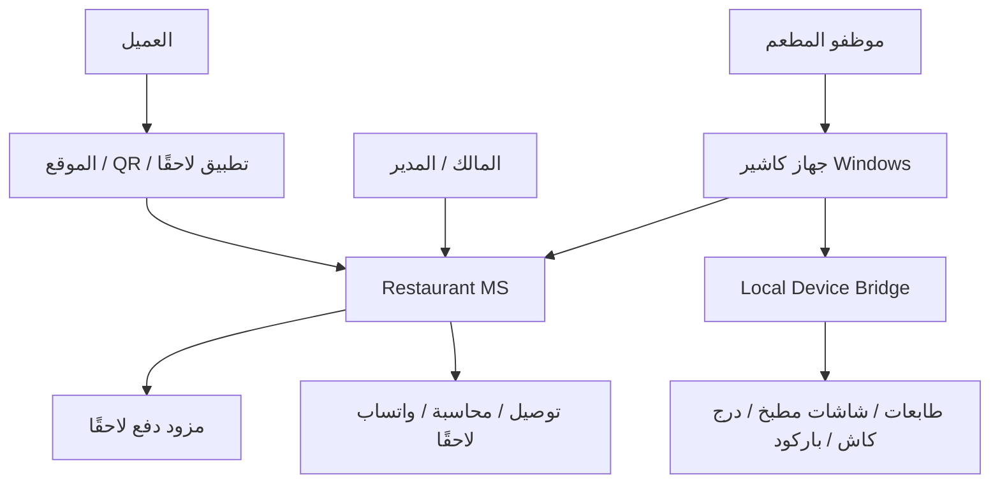

---

## 2. مخطط التطبيقات Application Containers

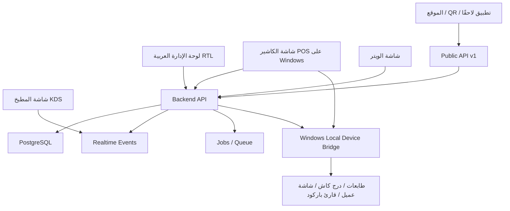

---

## 3. نموذج الدومين الأساسي Core Domain Model

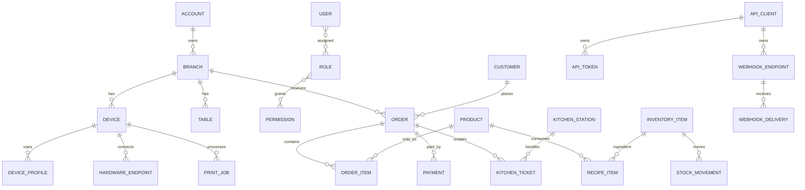

---

## 4. دورة حياة الطلب Order Lifecycle

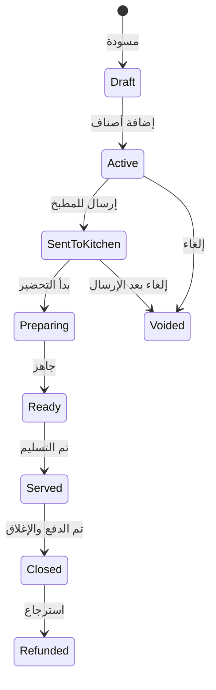

---

## 5. تسلسل طلب صالة Dine-in Sequence

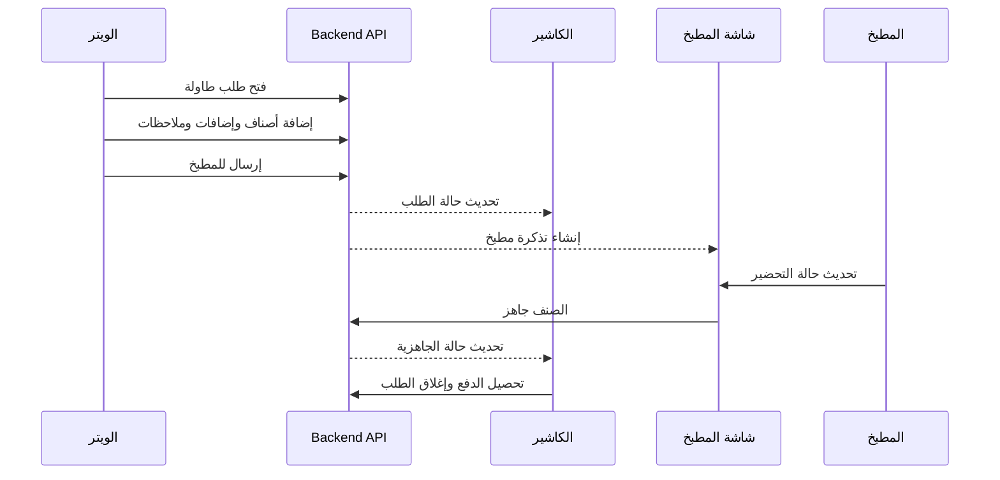

---

## 6. تسلسل طلب أونلاين Online / QR Sequence

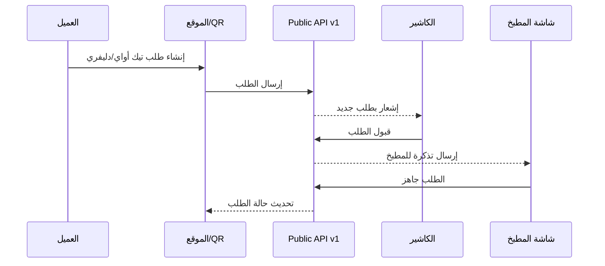

---

## 7. تدفق الطباعة والهاردوير Windows Hardware Bridge

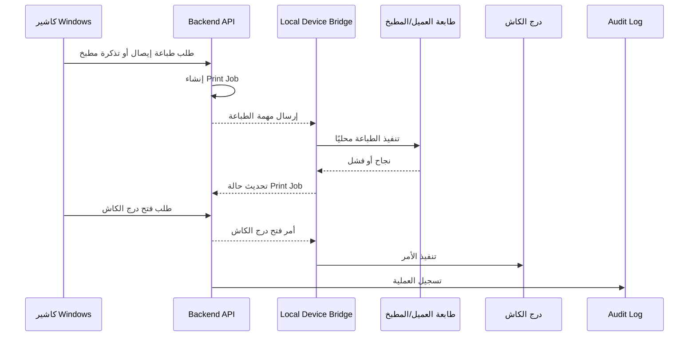

---

## 8. تدفق الصلاحيات RBAC

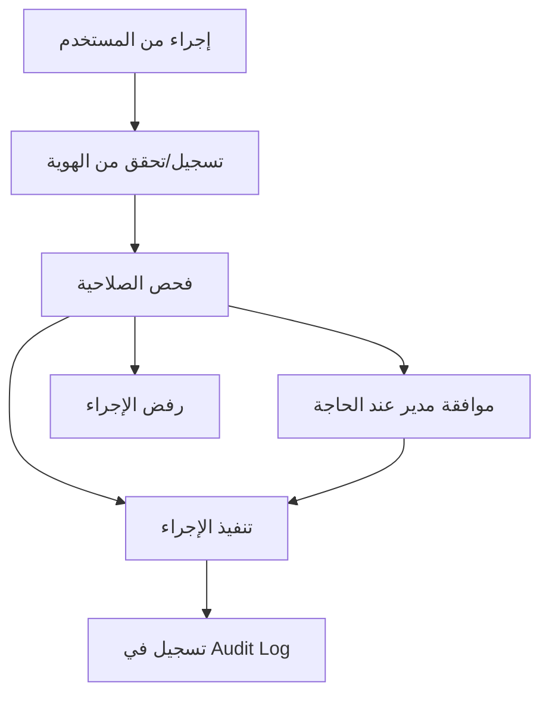

---

## 9. تدفق المخزون والوصفة Inventory Deduction

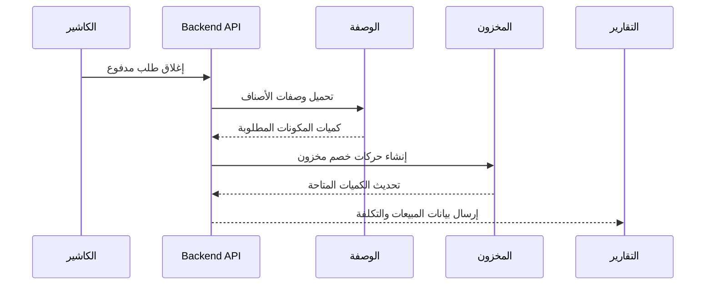

---

## 10. تدفق Public API للموقع و QR

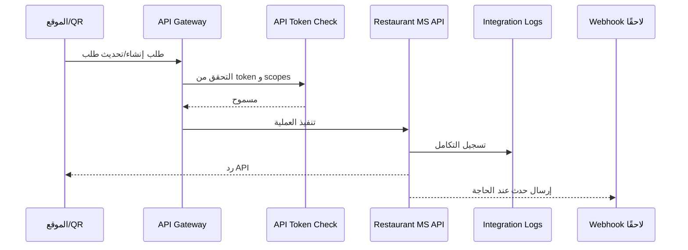

---

## 11. قاعدة RTL في واجهة المستخدم

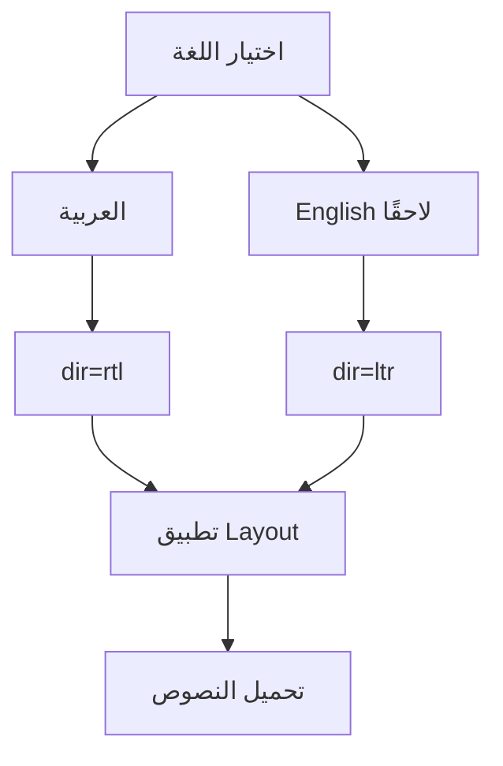

