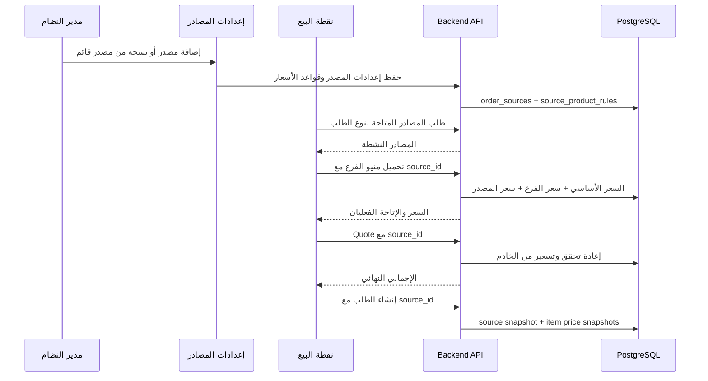

# YAKEBDA MS — Flowcharts & Diagrams Roadmap

---

## 8. Order Source Pricing Flow — YKMS-02H

```mermaid
sequenceDiagram
    participant Admin as مدير النظام
    participant Settings as إعدادات المصادر
    participant POS as نقطة البيع
    participant API as Backend API
    participant DB as PostgreSQL

    Admin->>Settings: إضافة مصدر أو نسخه من مصدر قائم
    Settings->>API: حفظ إعدادات المصدر وقواعد الأسعار
    API->>DB: order_sources + source_product_rules

    POS->>API: طلب المصادر المتاحة لنوع الطلب
    API-->>POS: المصادر النشطة
    POS->>API: تحميل منيو الفرع مع source_id
    API->>DB: السعر الأساسي + سعر الفرع + سعر المصدر
    API-->>POS: السعر والإتاحة الفعليان

    POS->>API: Quote مع source_id
    API->>DB: إعادة تحقق وتسعير من الخادم
    API-->>POS: الإجمالي النهائي
    POS->>API: إنشاء الطلب مع source_id
    API->>DB: source snapshot + item price snapshots
```

