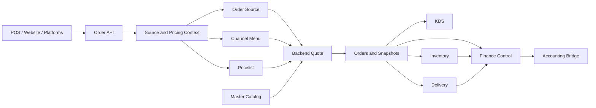
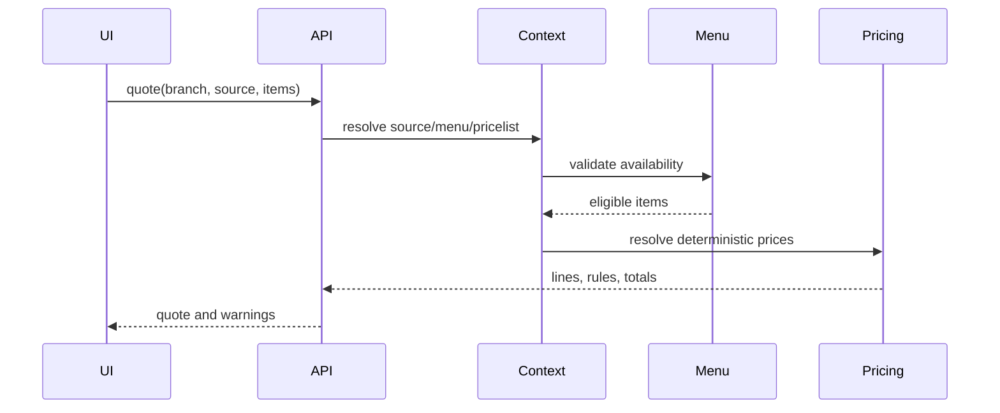
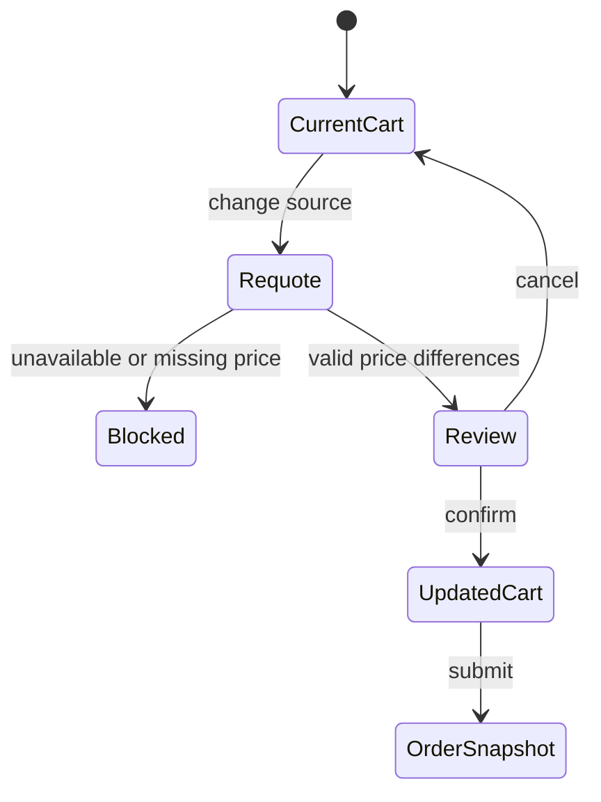
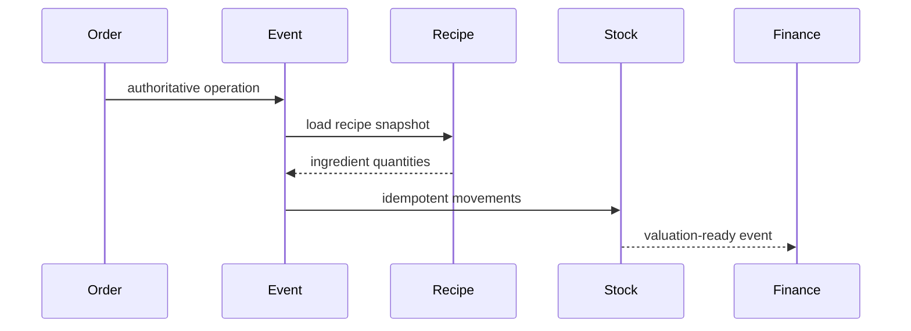
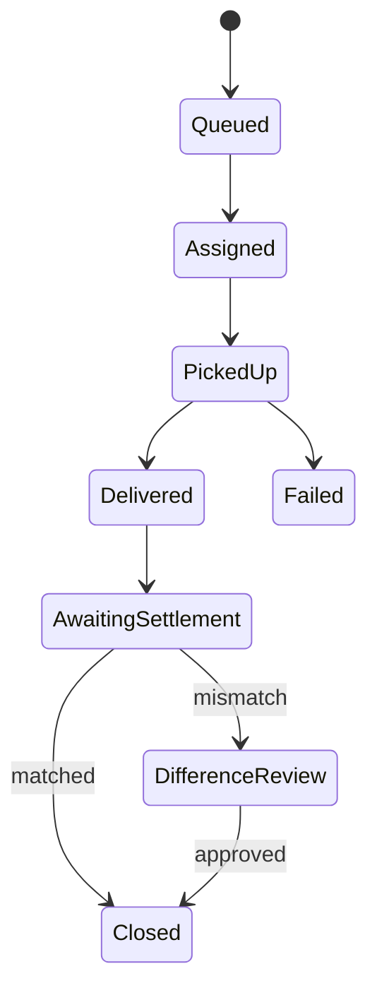
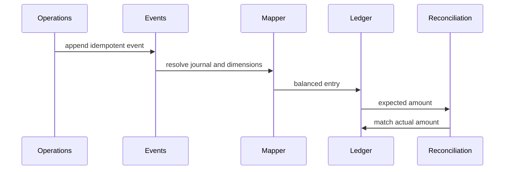

# YAKEBDA MS — Diagrams Roadmap v2.1

**الحالة:** Canonical  
**Baseline:** PR #14 مدموجة في `main`

## Program Sequence

```mermaid
flowchart LR
    BASE["Main baseline"] --> S11["YKMS-11 Sources and Pricing"]
    S11 --> S12["YKMS-12 Channel Menus"]
    S12 --> S13["YKMS-13 Inventory and Recipes"]
    S13 --> S14["YKMS-14 Delivery and Drivers"]
    S14 --> S15["YKMS-15 Finance Control"]
    S15 --> S16["YKMS-16 Accounting and COGS"]
    S16 --> S17["YKMS-17 Online Connectors"]
    S17 --> S18["YKMS-18 e-Receipt"]
```

## Target Architecture

## Quote Sequence

## Source Repricing

## Inventory Deduction

## Delivery Settlement

## Finance Flow

## Required Diagrams

| المرحلة | المخططات |
|---|---|
| YKMS-11 | ERD، Quote Sequence، Repricing State |
| YKMS-12 | Publishing، Mapping، Sync |
| YKMS-13 | Inventory ERD، Movement، Deduction |
| YKMS-14 | Dispatch، Driver State، Settlement |
| YKMS-15 | Expense State، Reconciliation |
| YKMS-16 | Posting، Reversal، Backfill |
| YKMS-17 | Adapter، Webhook Retry |
| YKMS-18 | Submission، Retry، Status |

