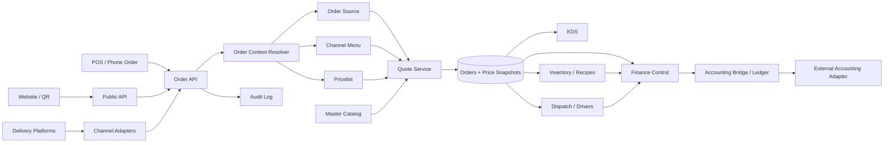
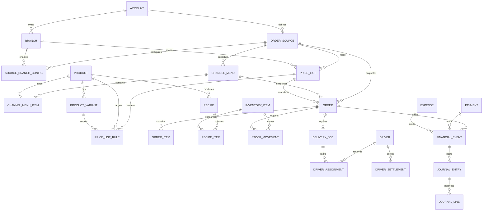
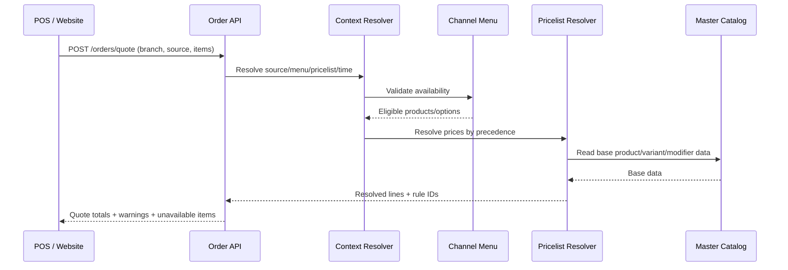
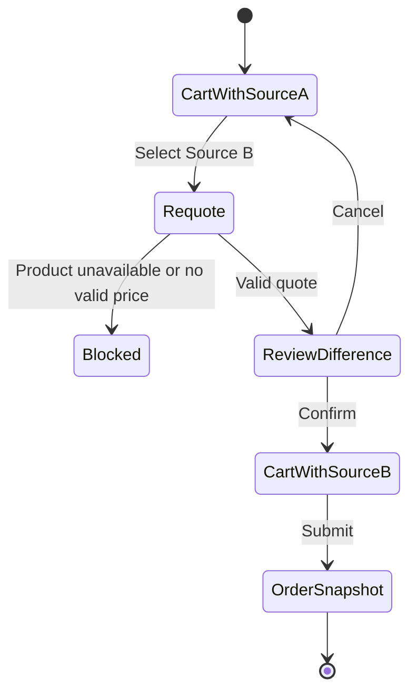
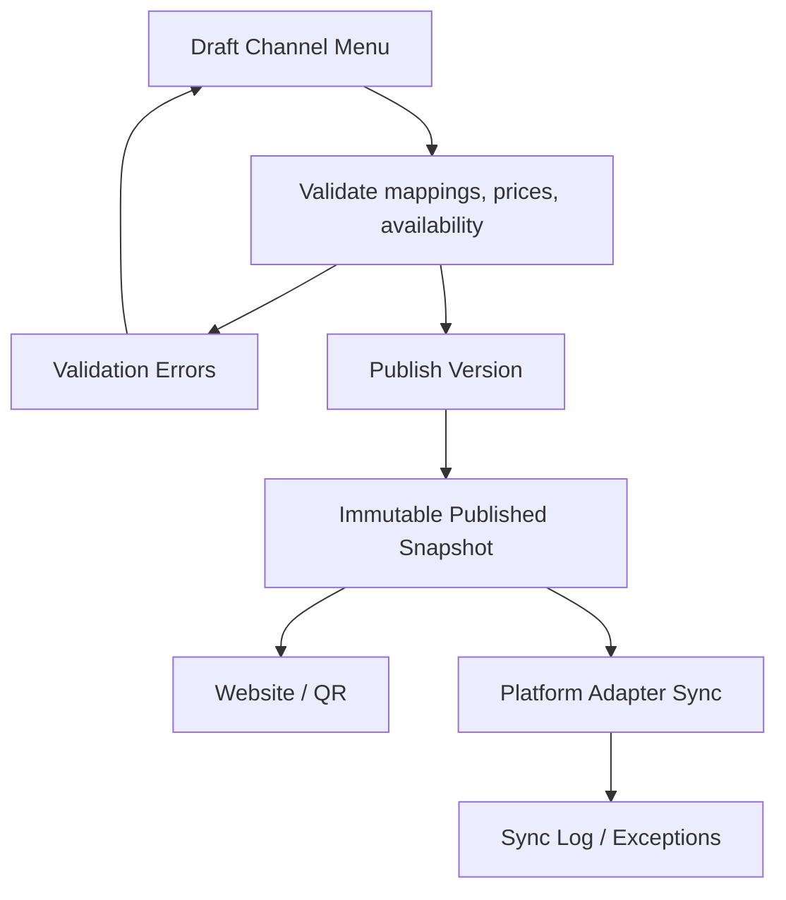
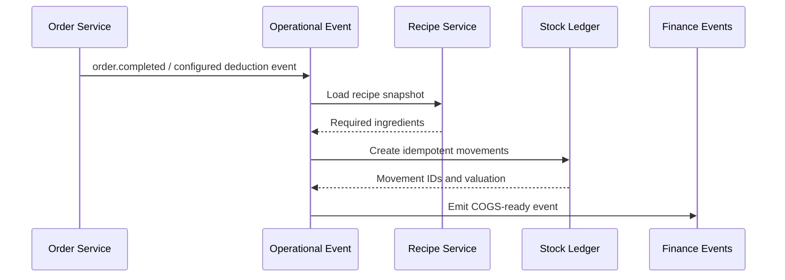
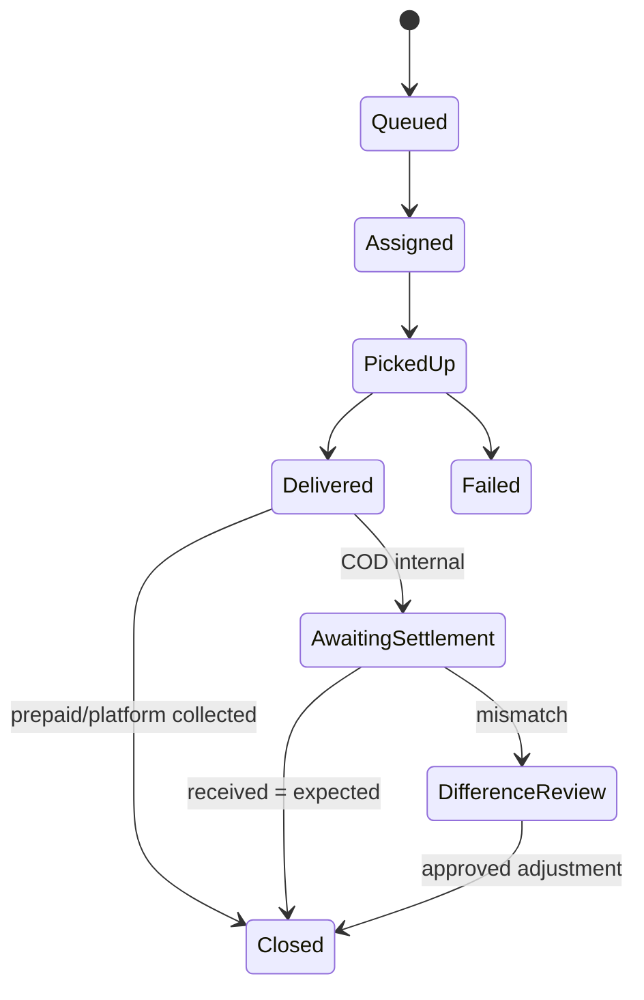
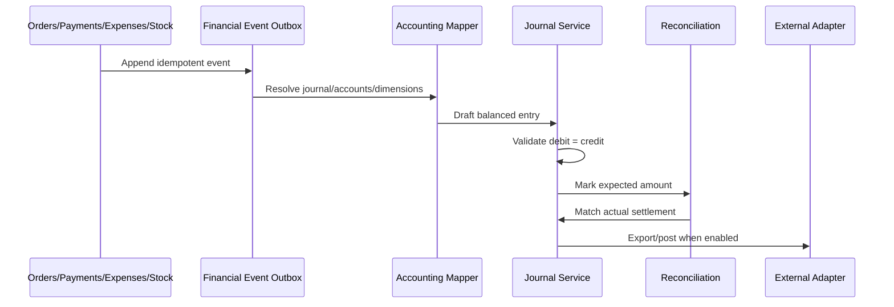

# YAKEBDA MS — Diagrams Roadmap v2 AR/RTL

**التاريخ:** 2026-07-12  
**الحالة:** Canonical Architecture Diagrams  
**المصدر:** Mermaid داخل GitHub

---

## 1. Target Architecture

---

## 2. Program Roadmap

```mermaid
flowchart LR
    G0["Gate 0: Merge PR #14"] --> M11["YKMS-11 Sources & Pricing"]
    M11 --> M12["YKMS-12 Channel Menus"]
    M12 --> M13["YKMS-13 Inventory & Recipes"]
    M13 --> M14["YKMS-14 Delivery & Drivers"]
    M14 --> M15["YKMS-15 Finance Control"]
    M15 --> M16["YKMS-16 Accounting Bridge & COGS"]
    M16 --> M17["YKMS-17 Online Connectors"]
    M17 --> M18["YKMS-18 e-Receipt"]
```

---

## 3. Core ERD

---

## 4. Quote Sequence

---

## 5. Change Source Repricing

---

## 6. Channel Menu Publishing

---

## 7. Inventory Deduction

---

## 8. Driver and COD Flow

---

## 9. Finance Event Flow

---

## 10. Required Diagrams per Stage

| المرحلة | المخططات الإلزامية |
|---|---|
| YKMS-11 | ERD + Quote Sequence + Repricing State |
| YKMS-12 | Publishing Flow + Mapping ERD + Sync Sequence |
| YKMS-13 | Inventory ERD + Movement State + Deduction Sequence |
| YKMS-14 | Dispatch State + COD Settlement Sequence |
| YKMS-15 | Expense State + Reconciliation Flow |
| YKMS-16 | Financial Event + Journal Posting + Reversal Flow |
| YKMS-17 | Adapter Sequence + Webhook Retry |
| YKMS-18 | e-Receipt Submission/Retry/Status |

