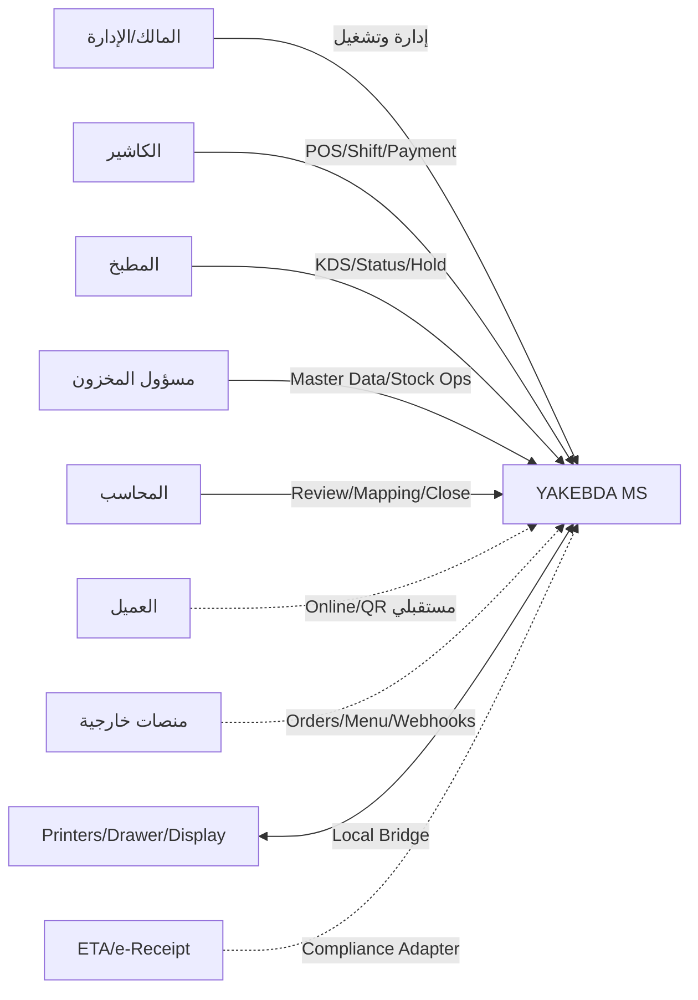
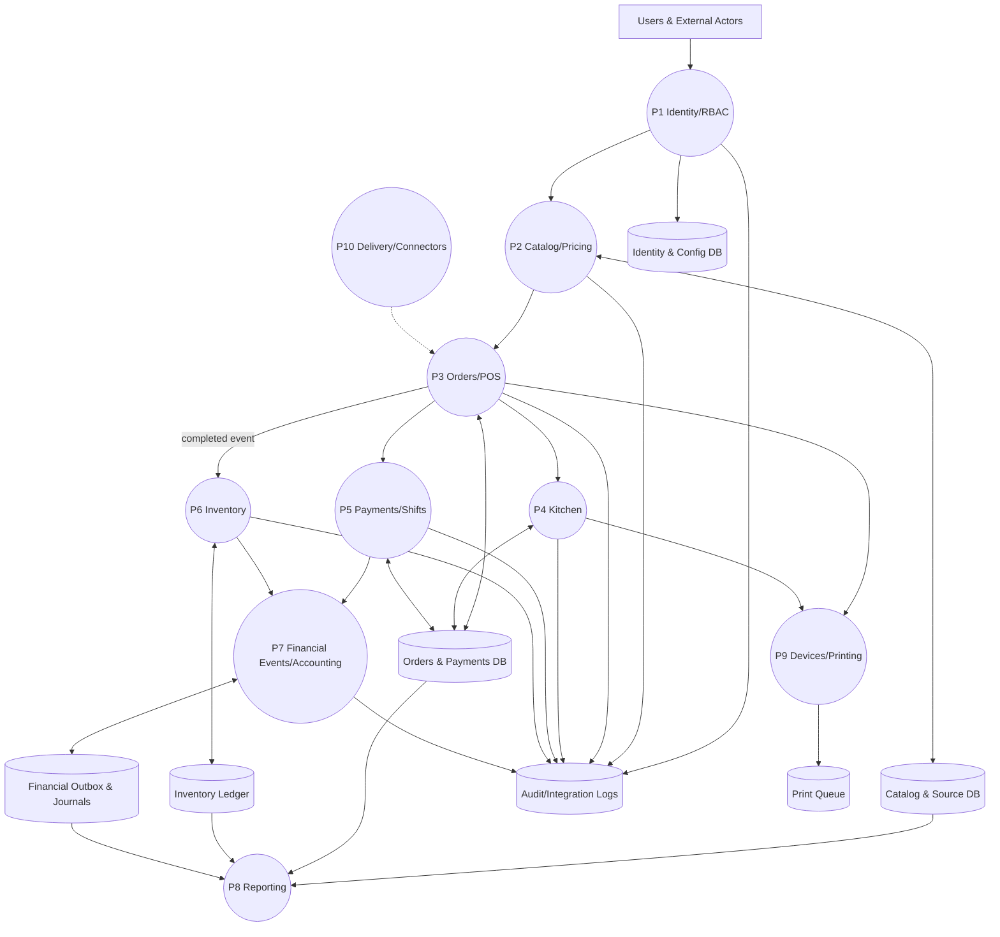
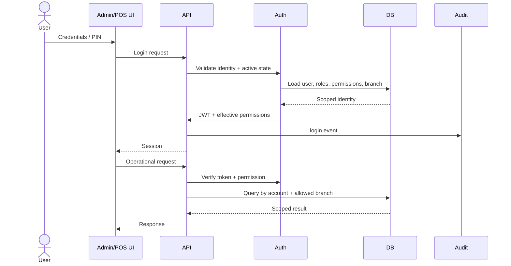
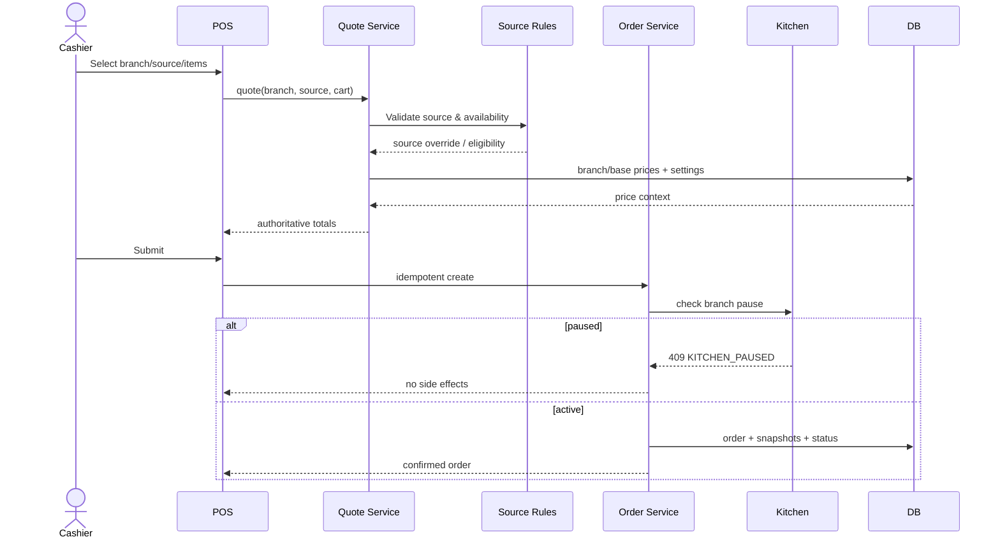
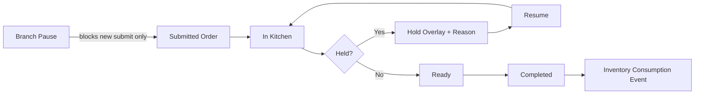
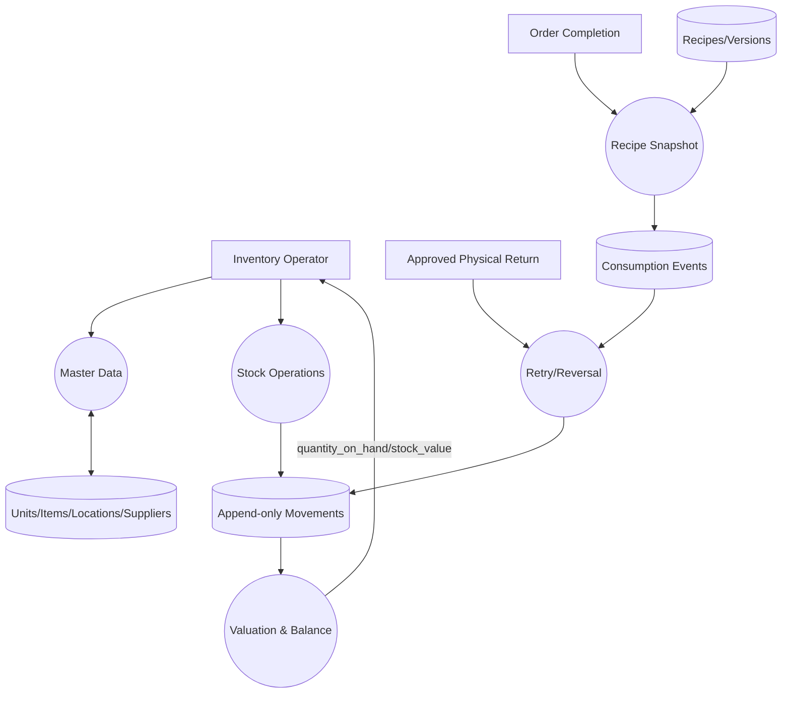
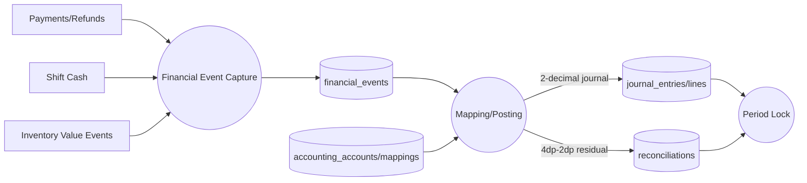
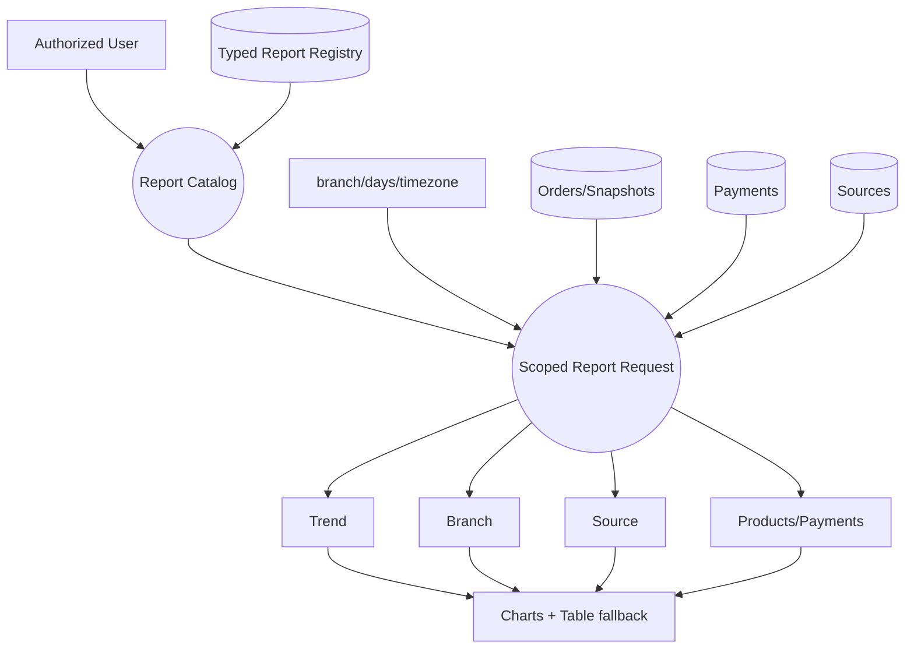
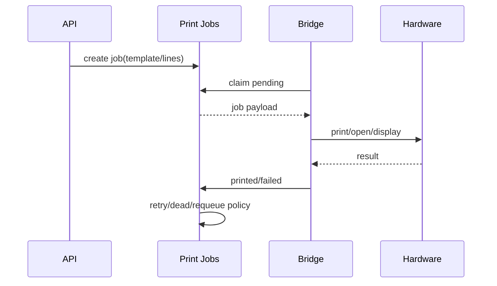
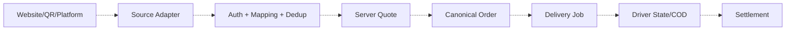

# YAKEBDA MS — Data Flow Diagrams v1.0

**التاريخ:** 2026-07-18  
**الحالة:** Canonical DFD  
**الترميز:** Mermaid؛ الخطوط المتقطعة = planned/partial

## 1. Context Diagram

## 2. Level 0 — Major Processes

## 3. Authentication and Scope Flow

## 4. POS Quote and Order Flow

## 5. Kitchen Flow

## 6. Inventory DFD

### قواعد التدفق

- كل write يحمل idempotency key.
- conversion إلى base unit قبل الحركة.
- issue لا يمر إذا الناتج negative.
- movement لا يُعدل أو يُحذف.
- refund مالي وحده لا يدخل هذا التدفق.

## 7. Financial Event and Accounting DFD

## 8. Reporting DFD — Draft #44

Draft boundary: لا persisted report run ولا export parity claim حتى تنفيذها.

## 9. Printing/Bridge Flow

## 10. Planned Delivery/Connector Flow

## 11. Trust Boundaries

| Boundary | Control |
|---|---|
| Browser→API | JWT، permission، schema validation |
| API→DB | account/branch predicates + constraints |
| API client/platform→API | scoped hashed token + idempotency |
| API→Bridge | scoped job claim + typed payload |
| Operational→Accounting | immutable outbox + mapping + evidence |
| Reporting→UI | typed metadata + no coercion of invalid values إلى fake zero |

## 12. Current Gaps Reflected in DFD

- Inventory UI writes لا تزال Draft/مفقودة حسب العملية.
- Accounting UI غير موجودة.
- Reporting flow Draft.
- Delivery/connectors dotted لأنها future.
- Physical bridge deployment evidence غير مثبت.

