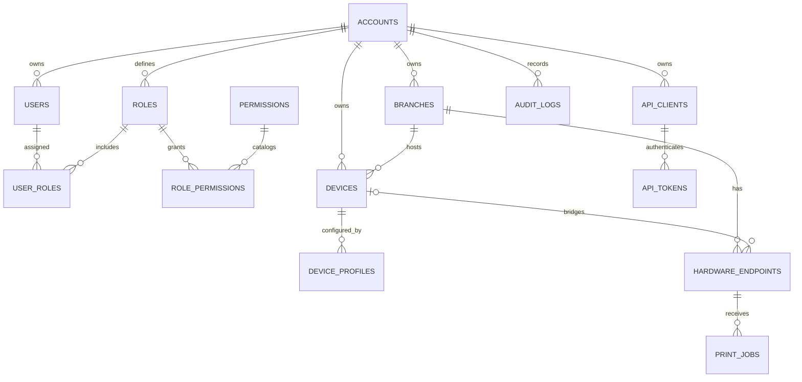
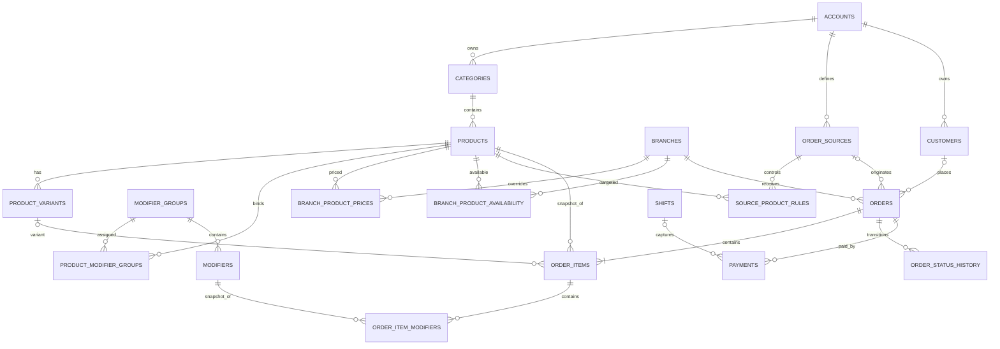
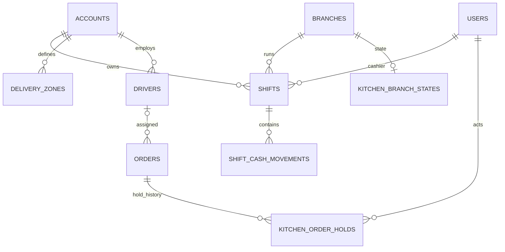
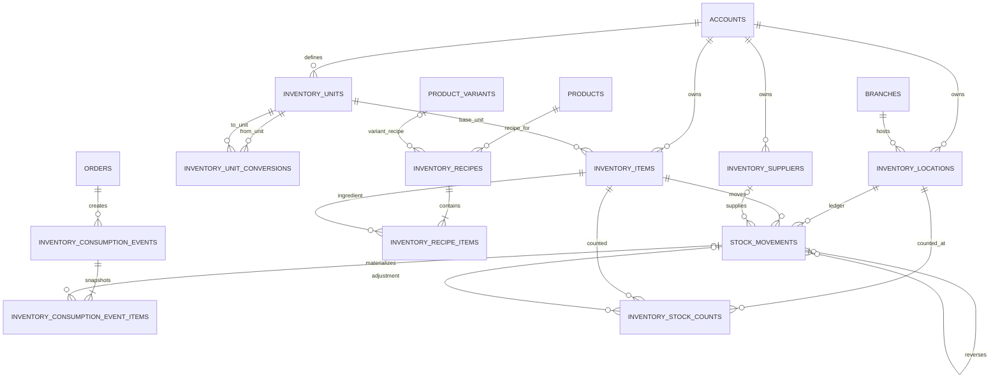
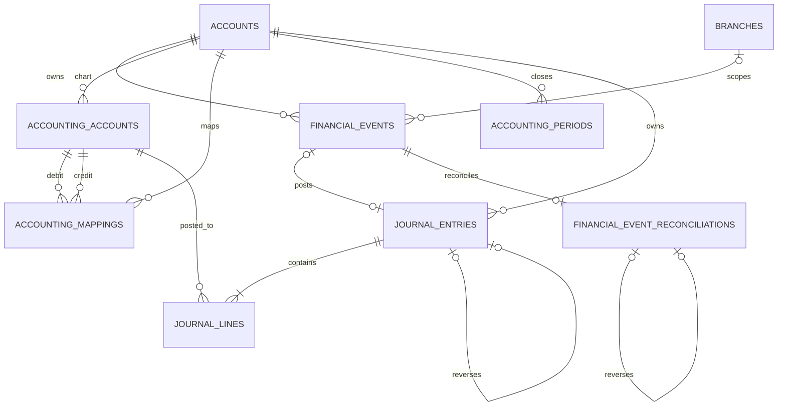

<div dir="rtl" align="right">

# YAKEBDA MS — Entity Relationship Diagrams v1.0

**التاريخ:** 2026-07-18  
**الحالة:** Canonical schema map based on migrations 001–027  
**ملاحظة:** الأعمدة المعروضة مختارة لفهم العلاقات، وليست dump كامل.

## 1. Identity / RBAC / Devices



## 2. Catalog / Sources / Orders



## 3. Shifts / Delivery Light / Kitchen



## 4. Inventory



## 5. Accounting



## 6. Core Entity Dictionary

| Entity | Authority | Mutability |
|---|---|---|
| `orders` | operational order aggregate | status transitions controlled |
| `order_items` | sale snapshot | historical |
| `payments` | tender events | offset by refunds، not rewrite |
| `stock_movements` | stock quantity/value ledger | append-only |
| `inventory_recipes` | versioned recipe | draft/active/retired; old versions retained |
| `inventory_consumption_events` | durable completion/reversal snapshot | retry state; payload immutable logically |
| `financial_events` | accounting outbox | payload immutable; status transitions |
| `journal_entries/lines` | posted accounting evidence | immutable; reversal only |
| `financial_event_reconciliations` | sub-cent evidence | lineage/settlement governed |
| `audit_logs` | security/operational evidence | append-only expectation |

## 7. Current vs Target Schema

### موجود فعليًا

كل الكيانات في المخططات السابقة موجودة ضمن migrations 001–027.

### Target entities غير موجودة بعد

```text
channel_menus
channel_menu_versions
channel_menu_items
external_product_mappings
price_lists
price_list_rules
source_settlement_rules

delivery_jobs
driver_assignments
driver_cash_custody
driver_settlements

expense_categories
expenses
payment_reconciliations
source_settlements
daily_finance_closes

accounting_exports
compliance_submissions
webhook_deliveries
```

لا تُرسم target entities كأنها موجودة في قاعدة الإنتاج.

## 8. Schema Integrity Notes

- بعض العلاقات التاريخية بدأت بـFKs بسيطة؛ migration 026 أضاف composite account/branch integrity في المسارات المالية والمخزنية الحرجة.
- source product rules الحالية ليست full pricelist model.
- delivery `drivers`/`delivery_zones` هي light primitives، ليست delivery job ledger.
- reporting registry الحالي في Draft #44 code-owned وليس table-driven.
- unit conversions لا يوجد لها GET endpoint في Draft #43 رغم وجود الجدول.

## 9. Upgrade Boundary

هذا ERD يصف schema canonical fresh 001–027. لا يثبت توافق partial legacy 019. ذلك baseline ملغى من النطاق الحالي ويحتاج قرار دعم منفصل لو أعيد فتحه.

</div>
