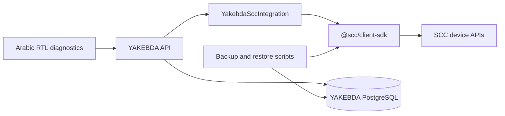

# Architecture

`packages/scc-client-sdk` owns device identity, enrollment proof, authenticated transport, bounded store-and-forward, signed license validation, typed configuration, and signed update coordination. `apps/api/src/scc` maps only allowlisted restaurant health signals and safe update preconditions. `apps/admin` provides a permission-gated status surface.

SCC calls run in the background or explicit operator actions. No SCC network call is awaited in POS, order, kitchen, print, or database transaction paths.
